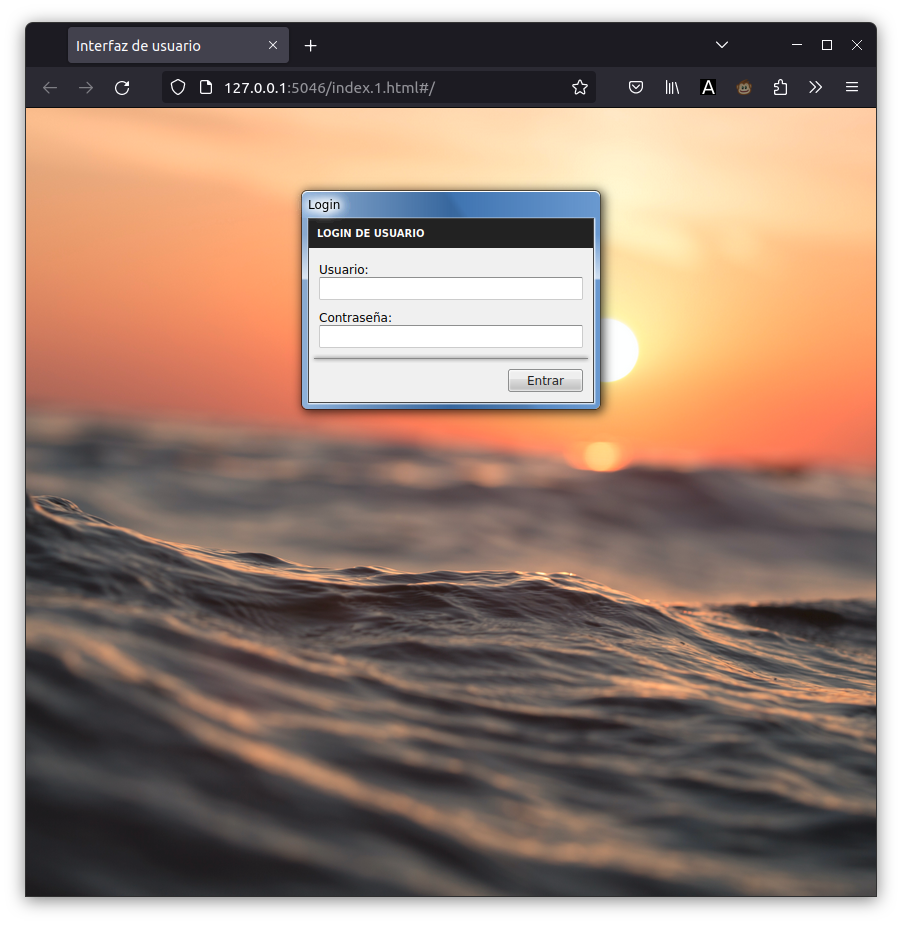
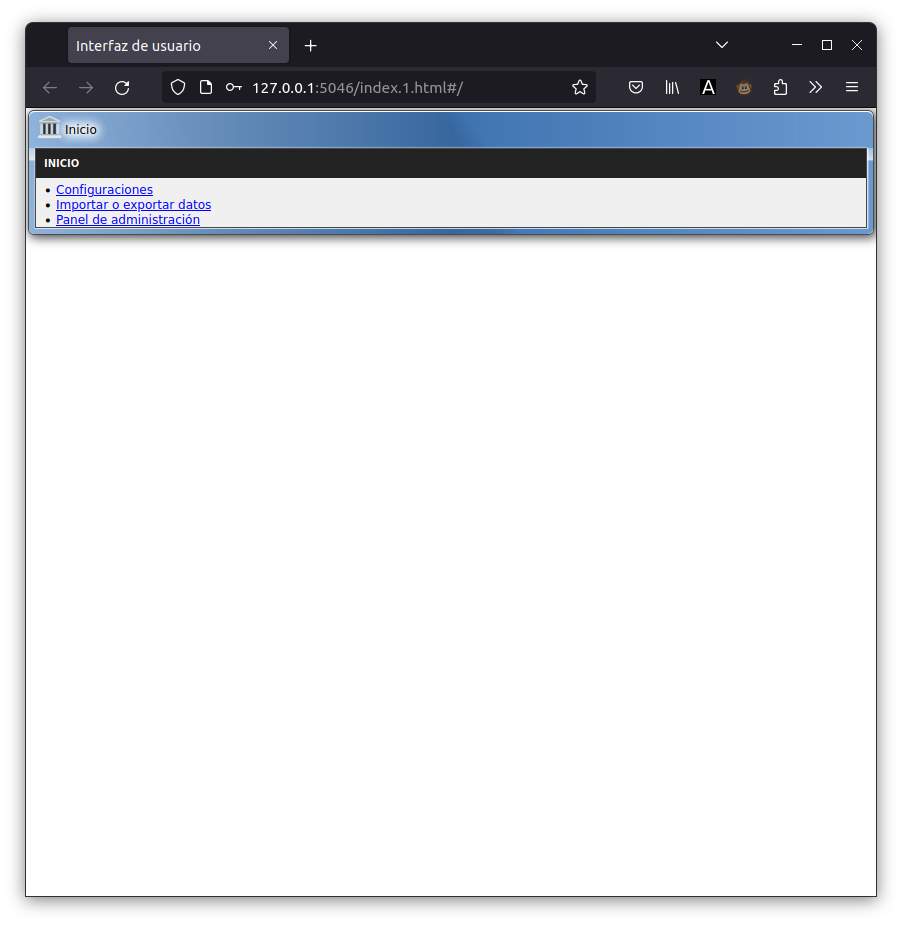
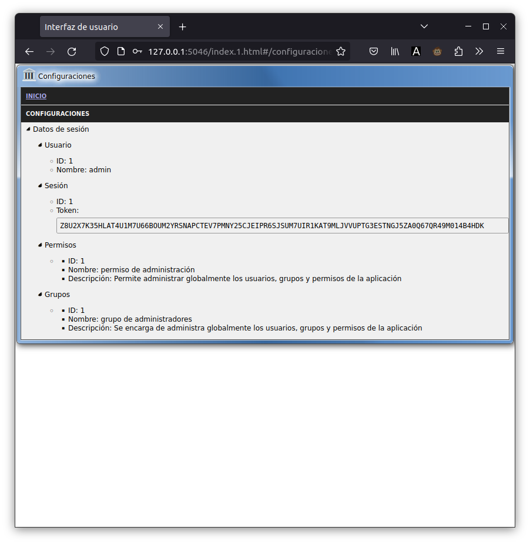
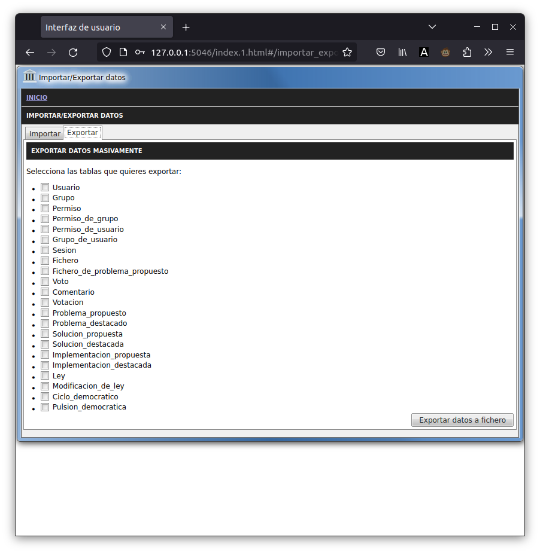
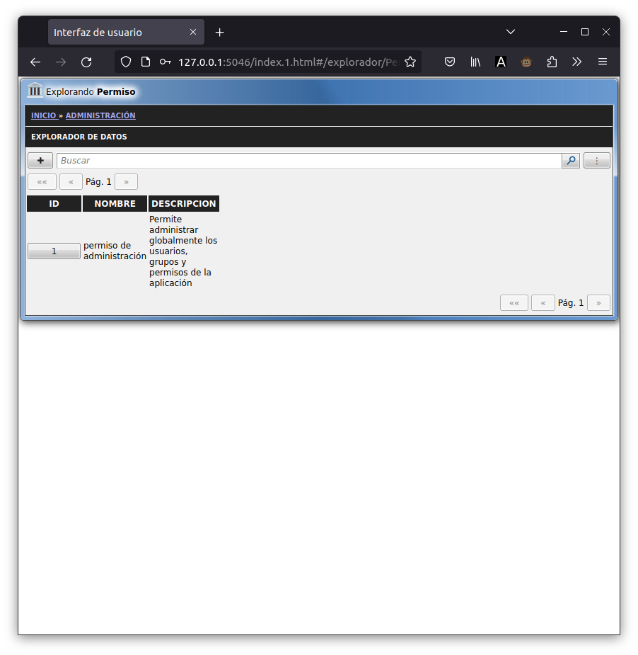
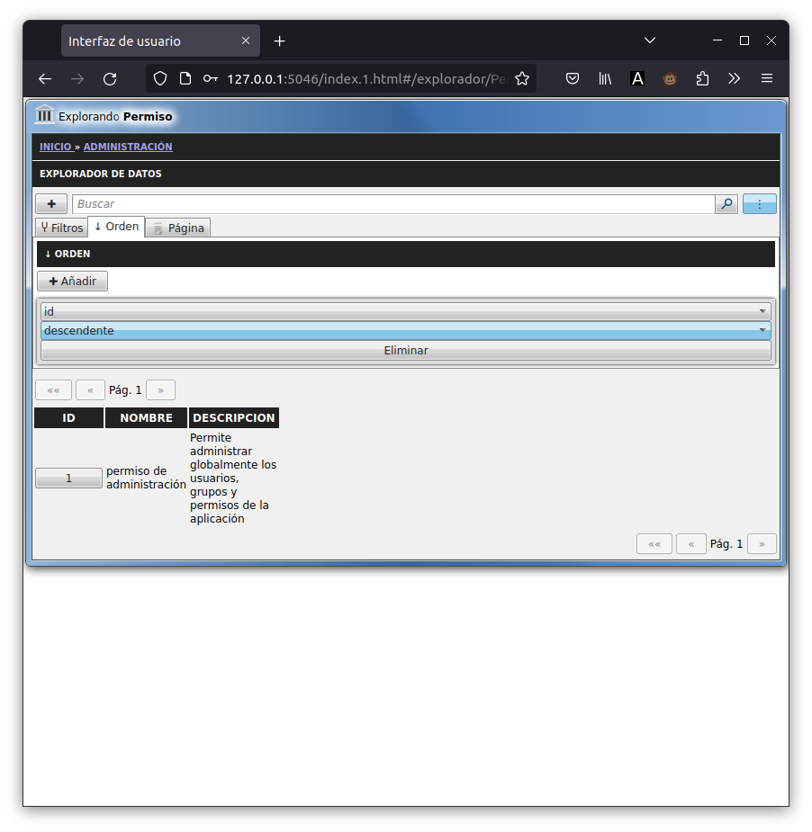
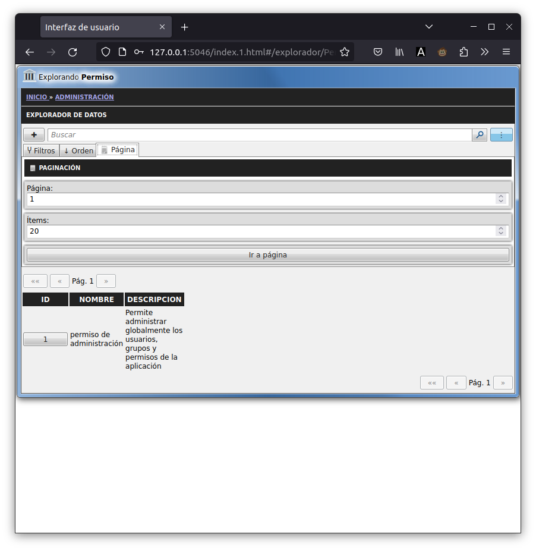
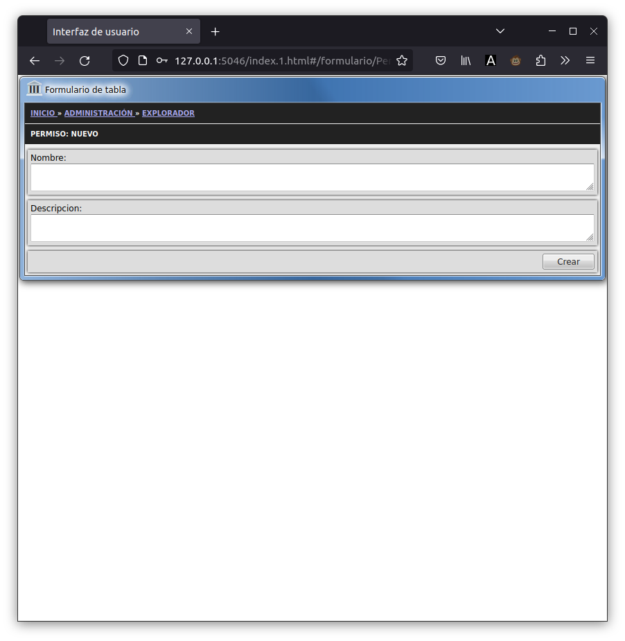
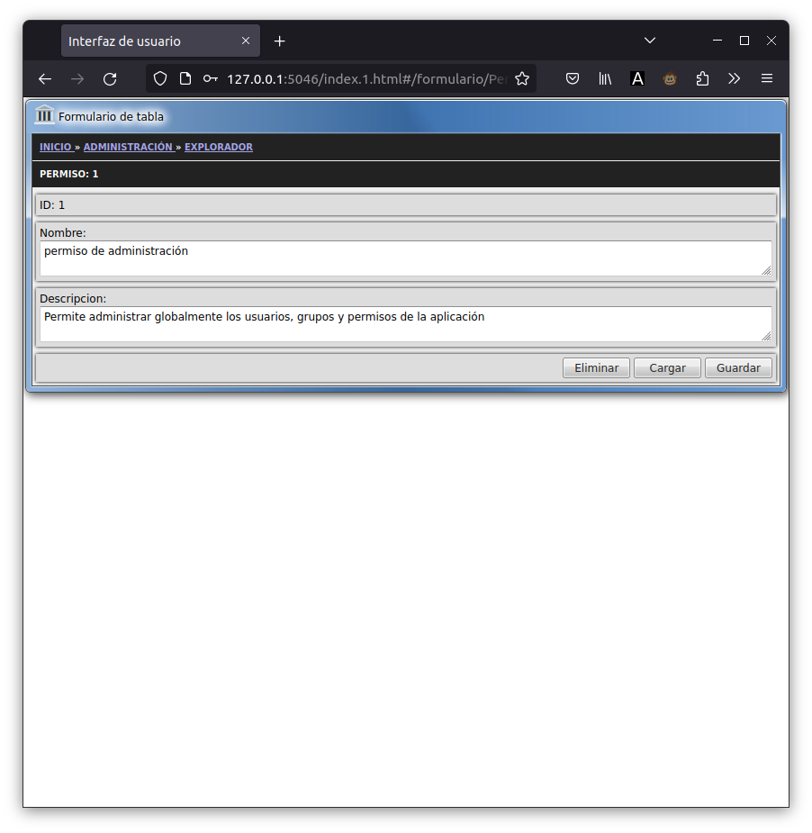

# restero

Despliega aplicaciones REST basadas en ficheros [HQL (o Hyper Query Language)](https://github.com/allnulled/h-query-language). 

## Índice

1. [Instalación](#instalación)
1. [Uso](#uso)
1. [Versiones](#versiones)
1. [Objetivo](#objetivo)
1. [Carpetas y ficheros](#introducción)
1. [El proceso de configuración manual](#el-proceso-de-configuración-manual)
1. [El proceso de despliegue](#el-proceso-de-despliegue)
1. [El proceso de tests](#el-proceso-de-tests)
1. [Peticiones disponibles](#peticiones-disponibles)
   1. Ejemplo de `login`
   1. Ejemplo de `logout`
   1. Ejemplo de `select`
   1. Ejemplo de `insert`
   1. Ejemplo de `update`
   1. Ejemplo de `delete`
   1. Ejemplo de `getfile`
   1. Ejemplo de `setfile`
1. [Los hiperatributos](#los-hiperatributos)
   1. Hiperatributo de columna: `es_fichero`
   1. Hiperatributo de columna: `es_opcion`
1. [Los autorizadores](#los-autorizadores)
   1. Autorizador de tabla: `no_actualizable`
   1. Autorizador de tabla: `no_eliminable`
   1. Autorizador de tabla: `no_insertable`
   1. Autorizador de tabla: `no_modificable`
   1. Autorizador de tabla: `no_seleccionable`
   1. Autorizador de tabla: `no_usable`
   1. Autorizador de tabla: `no_visibles_columnas`
   1. Autorizador de tabla: `solo_actualizable_por_mismo_usuario`
   1. Autorizador de tabla: `solo_eliminable_por_mismo_usuario`
   1. Autorizador de tabla: `solo_insertable_por_mismo_usuario`
   1. Autorizador de tabla: `solo_modificable_por_mismo_usuario`
   1. Autorizador de tabla: `solo_seleccionable_por_mismo_usuario`
   1. Autorizador de tabla: `incluir`
   1. Autorizador de tabla: `excluir`
   1. Autorizador de columna: `no_actualizable`
   1. Autorizador de columna: `no_insertable`
   1. Autorizador de columna: `no_modificable`
   1. Autorizador de columna: `solo_modificable_por`
1. [Interfaz de línea de comandos](#interfaz-de-línea-de-comandos)
   1. Comando `restero generar`
   1. Comando `restero generar:seeder`
1. [Interfaz de usuario](#interfaz-de-usuario)
   1. Imágenes del login
   1. Imágenes del panel de inicio
   1. Imágenes del panel de configuraciones
   1. Imágenes del panel de importaciones y exportaciones
   1. Imágenes de las secciones de datos
   1. Imágenes del explorador de datos
   1. Imágenes del formulario de datos
1. [Interfaz de API de Node.js](#interfaz-de-api-de-nodejs)
1. [Hooks](#hooks)
   1. Hooks en el servidor
   1. Hooks en la aplicación de usuario
1. [Guía de desarollo](#guía-de-desarrollo)
   1. Índice
   1. Prerrequisitos
   1. Guía de desarrollo del backend
      1. Crear el proyecto
      1. Ejecutar el proyecto
      1. Modificar el proyecto
      1. Modificaciones avanzadas
   1. Guía de desarrollo del frontend

## Instalación

**Paso 1.** Descárgate el proyecto entero con:

```sh
git clone https://github.com/allnulled/restero.git .
```

**Paso 2.** Instala las dependencias automáticamente con el comando:

```sh
npm install
```

Alternativamente, puedes usar la línea de comandos para generar un proyecto automáticamente. Para esto, te tendrías que descargar este paquete de NPM:

  - [https://www.npmjs.com/package/restero](https://www.npmjs.com/package/restero)

Para usar la línea de comandos para generar el proyecto, puedes consultar la sección de [Interfaz de línea de comandos](#interfaz-de-línea-de-comandos) de este documento.


## Uso 

**Paso 1.** Crea y coloca el script en [HQL](https://github.com/allnulled/h-query-language) en el fichero `src/configurations/db.sql`.

**Paso 2.** Revisa las configuraciones del *deployer* en el fichero `src/configurations/settings.json`.

**Paso 3.** Revisa también el fichero de migración inicial si escaece, en `src/configurations/db/migrations/migracion.sql` que se ejecutará automáticamente en caso que la base de datos deba crearse.

También está el fichero vecino `migracion.test.sql` que se ejecutará en caso de que el booleano `DB_TEST_MIGRATION` en `src/configurations/settings.json` esté en `true`.

**Paso 4.** Despliega la aplicación con el comando:

```sh
npm start
```

Este comando creará la base de datos si la primera tabla del script no existe (`Usuario`), y aplicará la migración inicial. La de tests en caso de que esté activada en el `configurations/settings.json`. Si la tal primera tabla está creada, obviará estos pasos, y continuará la ejecución del despliegue del servidor.

**Paso 5.** Ya puedes hacer todas las operaciones CRUD automáticamente mediante HTTP, por ejemplo:

  - `/api/v1/insert/Usuario?nombre=Alicia&domicilio=El país de las villas de Mara`
  - `/api/v1/update/Usuario?id=1&nombre=Bob`
  - `/api/v1/select/Usuario?`
  - `/api/v1/delete/Usuario?id=1`

Precisamente, `Usuario` es una tabla que viene bloqueada por un autorizador `no_usable`. Pero si sacáramos este autorizador, estaría disponible.

Nótese que las operaciones de UPDATE y DELETE requieren siempre del campo `id`. De lo contrario, darán error. Esto invalida poder usar múltiples `PRIMARY KEY` en una tabla, de momento. Esto último se debe a limitaciones del `sqlite`, porque otras como `mysql` sí lo ofrecen independientemente en su sintaxis (véase `MULTIPLE KEY` de `mysql`, pero no de `sqlite`).

También puedes usar `login` y `logout` así:

  - `/api/v1/login?nombre=admin&contrasenya=admin`
  - `/api/v1/logout?token_de_sesion=43U3TIQA7J8F8GKOVK1Q0E4XMTXEWZVK0IUA5S163QLDJ...`

## Versiones

!Ir al [CHANGELOG](./docs/imagenes/CHANGELOG.md) para ver especificidades de cada versión.

## Objetivo

El objetivo de este software es *minimizar y optimizar el desarrollo y despliegue de REST HTTP APIs* basadas en bases de datos SQL.

El modo en que esto se consigue es añadiendo unas notaciones con comentarios en el script de creación de bases de datos, el deployer lo parsea y lo tiene en cuenta para incorporar funcionalidades automáticamente.

## Carpetas y ficheros

El árbol de ficheros base es el que sigue, y que podemos actualizar con `npm run build-tree` (aunque usa el programa de Linux `tree`):

```
.
├── bin
│   ├── restero.bin.js
│   └── seeder
│       ├── develop.sh
│       ├── input
│       │   └── src
│       │       └── configurations
│       │           └── db
│       │               └── db.ejs.sql
│       ├── seeder.sh
│       └── start.sh
├── CHANGELOG.md
├── docs
│   └── imagenes
│       ├── imagen-10.explorador.pagina.png
│       ├── imagen-11.formulario.crear.png
│       ├── imagen-11.formulario.editar.png
│       ├── imagen-1.login.png
│       ├── imagen-2.login.png
│       ├── imagen-3.inicio.png
│       ├── imagen-4.configuraciones.png
│       ├── imagen-5.importaciones.png
│       ├── imagen-6.exportaciones.png
│       ├── imagen-7.explorador-de-datos.png
│       ├── imagen-7.secciones.png
│       ├── imagen-8.explorador.filtros.png
│       └── imagen-9.explorador.orden.png
├── package.json
├── package-lock.json
├── README.md
├── src
│   ├── api.js
│   ├── authorizers
│   │   ├── columns
│   │   │   ├── no_actualizable.js
│   │   │   ├── no_insertable.js
│   │   │   ├── no_modificable.js
│   │   │   └── solo_modificable_por.js
│   │   ├── es_administrador.js
│   │   ├── espera_segundos.js
│   │   ├── excluir.js
│   │   ├── incluir.js
│   │   ├── index.js
│   │   ├── mientras_clave_multiple.js
│   │   ├── no_actualizable.js
│   │   ├── no_eliminable.js
│   │   ├── no_insertable.js
│   │   ├── no_modificable.js
│   │   ├── no_seleccionable.js
│   │   ├── no_usable.js
│   │   ├── no_visibles_columnas.js
│   │   ├── solo_actualizable_por_mismo_usuario.js
│   │   ├── solo_eliminable_por_mismo_usuario.js
│   │   ├── solo_insertable_por_mismo_usuario.js
│   │   ├── solo_modificable_por_mismo_usuario.js
│   │   └── solo_seleccionable_por_mismo_usuario.js
│   ├── configurations
│   │   ├── db
│   │   │   ├── db.ejs.sql
│   │   │   ├── migrations
│   │   │   │   ├── migracion.sql
│   │   │   │   └── migracion.test.sql
│   │   │   └── modules
│   │   │       ├── asamblea.ejs.sql
│   │   │       ├── autorizacion.ejs.sql
│   │   │       ├── ejemplos.ejs.sql
│   │   │       ├── ejemplos.ejs.sql.json
│   │   │       └── ficheros.ejs.sql
│   │   ├── db.instancia.sqlite
│   │   ├── db.sql
│   │   ├── db.sql.json
│   │   ├── index.js
│   │   └── settings.json
│   ├── controllers
│   │   └── index.js
│   ├── dependencies
│   │   ├── generar_gestor_de_hooks.js
│   │   └── index.js
│   ├── deployer.js
│   ├── hooks
│   │   └── hooks.js
│   ├── parsers
│   │   ├── hyper-query-language.js
│   │   └── hyper-query-language.pegjs
│   ├── uploads
│   │   └── Fichero.1.fichero.calo-logo.png
│   ├── utilities
│   │   ├── controlador_de_esquema.js
│   │   ├── controlador_de_export_xlsx.js
│   │   ├── controlador_de_import_xlsx.js
│   │   ├── controlador_de_login.js
│   │   ├── controlador_de_logout.js
│   │   ├── controlador_de_operacion.js
│   │   ├── controlador_de_shutdown.js
│   │   ├── desplegar_base_de_datos.js
│   │   ├── desplegar_servidor.js
│   │   ├── gestionar_log_de_peticion.js
│   │   ├── gestionar_operacion_getfile.js
│   │   ├── gestionar_operacion_setfile.js
│   │   ├── gestor_de_error_de_peticion.js
│   │   ├── gestor_de_hooks.js
│   │   ├── gestor_de_shutdown.js
│   │   ├── importar_datos_masivos.js
│   │   ├── index.js
│   │   ├── leer_fichero_excel.js
│   │   ├── middleware_de_autentificacion.js
│   │   ├── middleware_de_autorizadores.js
│   │   ├── middleware_de_log.js
│   │   ├── middleware_de_parametros.js
│   │   ├── middleware_de_solo_administradores.js
│   │   ├── obtener_autentificacion.js
│   │   ├── obtener_conexion_de_base_de_datos.js
│   │   ├── obtener_date_como_string.js
│   │   ├── obtener_parametro.js
│   │   ├── obtener_string_aleatorio.js
│   │   ├── obtener_string_padeado.js
│   │   ├── obtener_string_partido_en_dos.js
│   │   ├── parsear_propiedades_como_json.js
│   │   ├── preparar_delete.js
│   │   ├── preparar_insert.js
│   │   ├── preparar_select.js
│   │   ├── preparar_update.js
│   │   └── tracear.js
│   └── www
│       └── files
│           ├── components
│           │   ├── BreadcrumbGenerico.component.calo
│           │   ├── BreadcrumbGenerico.component.js
│           │   ├── calo.calo
│           │   ├── calo.js
│           │   ├── ExploradorDeDatos.component.calo
│           │   ├── ExploradorDeDatos.component.js
│           │   ├── PaginaDeExploradorDeDatosDeTabla.component.calo
│           │   ├── PaginaDeExploradorDeDatosDeTabla.component.js
│           │   ├── PaginaDeFormularioDeTabla.component.calo
│           │   ├── PaginaDeFormularioDeTabla.component.js
│           │   ├── PaginaDeImportarExportarDatos.component.calo
│           │   ├── PaginaDeImportarExportarDatos.component.js
│           │   ├── PaginaDeInicio.component.calo
│           │   ├── PaginaDeInicio.component.js
│           │   ├── PaginaDeLogin.component.calo
│           │   ├── PaginaDeLogin.component.js
│           │   ├── PaginaDePanelDeAdministracion.component.calo
│           │   ├── PaginaDePanelDeAdministracion.component.js
│           │   ├── PaginaDePanelDeConfiguraciones.component.calo
│           │   ├── PaginaDePanelDeConfiguraciones.component.js
│           │   ├── PuertoDeNotificaciones.component.calo
│           │   ├── PuertoDeNotificaciones.component.js
│           │   ├── sea.jpg
│           │   ├── theme.css
│           │   └── win7.scoped.css
│           ├── dependencies
│           │   ├── generar_gestor_de_hooks.js
│           │   ├── rutas.calo
│           │   ├── rutas.js
│           │   ├── utilidades.calo
│           │   └── utilidades.js
│           ├── hooks
│           │   ├── hooks.calo
│           │   └── hooks.js
│           ├── index.1.calo
│           ├── index.1.html
│           ├── index.1.js
│           ├── index.html
│           ├── prueba.calo
│           └── prueba.js
├── test
│   ├── test-rudimentario.txt
│   ├── unit
│   │   ├── feature
│   │   │   ├── analisis.test.js
│   │   │   ├── incluir.test.js
│   │   │   ├── login.test.js
│   │   │   ├── logout.test.js
│   │   │   ├── no_visibles_columnas.test.js
│   │   │   ├── reset.test.js
│   │   │   ├── select_order.test.js
│   │   │   ├── select_page.test.js
│   │   │   ├── select_search.test.js
│   │   │   ├── solo_actualizable_por_mismo_usuario.test.js
│   │   │   ├── solo_eliminable_por_mismo_usuario.test.js
│   │   │   ├── solo_insertable_por_mismo_usuario.test.js
│   │   │   ├── solo_seleccionable_por_mismo_usuario.test.js
│   │   │   ├── volcan_1.png
│   │   │   └── volcan_2.png
│   │   ├── test.resultados.json
│   │   ├── test.sh
│   │   └── test.utilidades.js
│   ├── uno.ods
│   ├── uno.xlsx
│   └── uno.xml
├── TODO.md
└── tree.txt

29 directories, 164 files
```

Las carpetas originales son:

  - `src`: donde reside el código fuente del desplegador.
  - `test`: donde residen los tests de la aplicación.

Las carpetas internas originales son:

  - `src/authorizers/`: donde residen los autorizadores.
  - `src/configurations/`: donde residen ficheros considerados «de configuraciones».
  - `src/controllers/`: donde residen los controladores nuevos.
  - `src/dependencies/`: donde residen las dependencias.
  - `src/hooks/`: donde residen las hooks.
  - `src/logs/`: donde residen los logs del servidor, que se irán generando automáticamente si se activa en `src/configurations/settings.json` el flag `APP_LOGS`. Por defecto desactivado.
  - `src/parsers/`: donde residen los parsers.
  - `src/uploads/`: donde residen los ficheros subidos por los usuarios.
  - `src/utilities/`: donde residen los ficheros utilizados por el servidor.
  - `src/www/files/`: donde residen los ficheros estáticos, incluída la aplicación de usuario y dependencias.

Los ficheros que cargan carpetas son:

  - `src/authorizers/index.js`: donde
  - `src/configurations/index.js`
  - `src/controllers/index.js`
  - `src/utilities/index.js`

El fichero de hooks del servidor es:

  - `src/hooks/hooks.js`

El fichero de hooks de la aplicación de usuario es:

  - `src/www/files/hooks/hooks.js`
  - `src/www/files/hooks/hooks.calo`

El fichero que carga la aplicación es:

  - `src/deployer.js`

El fichero que carga la base de datos y el servidor son:

  - `src/utilities/desplegar_base_de_datos.js`
  - `src/utilities/desplegar_servidor.js`

Los ficheros relacionados con la base de datos son:

  - `src/configurations/db.sql`
  - `src/configurations/db.sql.json`
  - `src/configurations/db/migrations/migracion.sql`
  - `src/configurations/db/migrations/migracion.test.sql`
  - `src/configurations/db/db.ejs.sql`

El fichero de la aplicación estática y sus componentes son:

  - `src/www/files/index.1.calo`
  - `src/www/files/components/*`

## El proceso de configuración manual

El **proceso de configuración manual** del `restero` está pensado para ser rápido, sencillo pero potente, y consiste en:

  - `src/configurations/db.sql`: diseñar la base de datos que finalmente queremos desplegar.
  - `src/configurations/db/migrations/migracion.sql`: elaborar la migración inicial en todos los entornos. Esto se ejecuta si la base de datos debe crearse. La base de datos debe crearse si la primera tabla no está seleccionable. `Usuario` es la primera tabla, y `autorizacion.ejs.sql` es el primer módulo a cargar siempre.
  - `src/configurations/db/migrations/migracion.test.sql`: elaborar la migración inicial en el entorno de test.
  - `src/configurations/settings.json`: establecer los valores de configuración global preferidos. A continuación se listan los valores prestablecidos de la aplicación.
      - `APP_PORT`: `5046`. El puerto en el que el servidor se desplegará.
      - `DB_RESET`: `true`. Esto significa que cada vez que reinicies el sistema, las tablas se destruirán y se volverán a crear en función del script en `src/configurations/db.sql`, y consecuentemente se ejecutará la migración inicial en `src/configurations/migrations/migracion.sql`.
      - `DB_TEST_MIGRATION`: `false`. Ejecutará, en caso de que se esté migrando inicialmente la aplicación, el fichero en `src/configurations/migrations/migracion.test.sql`.
  - `src/configurations/db/db.ejs.sql`: diseñar la base de datos que queremos desplegar, pero a través de plantillas. Si escribes algo en este fichero a través de la plantilla ejs, el siguiente fichero `db.sql` se sobreescribirá con ello. Si no escribes nada, en cambio, valdrá lo que haya escrito en el `db.sql` directamente. Por defecto, no escribe nada. Este fichero permite desplegar la base de datos como si fueran módulos, y así componer la base de datos, pero su uso es opcional y por defecto está desactivado, solo hay comentarios de plantilla pero no imprime nada.

Si nos faltan controladores o autorizadores para completar nuestra aplicación, deberemos programarlos en:

  - `src/controllers`: para los nuevos controladores
  - `src/authorizers`: para los nuevos autorizadores
  - `src/authorizers/columns`: para los nuevos autorizadores, pero referidos a las columnas

Después, utilizarlos en la aplicación, sea vía el script `db.sql` y sus hiper-atributos, o sea vía editando el fichero de `src/utilities/desplegar_servidor.js`.

Situar los ficheros en estas carpetas nos permitirá acceder a ellos tal que: `deployer.controllers.mi_controlador` y `deployer.authorizers.mi_autorizador`, o `deployer.authorizers.columns.mi_otro_autorizador` en el caso de autorizadores de columna, y así los autorizadores funcionarán correctamente si son llamados desde el script `db.sql`.

## El proceso de despliegue

El **proceso de despliegue** del `restero` se inicia tan rápidamente como:

```sh
npm start
```

O también serviría, por equivalencia:

```sh
node src/deployer.js
```


El **proceso de despliegue** del `restero` está programado en el `src/deployer.js` y consiste, por este orden, en:

  - *Cargar dependencias*: carga los ficheros de `src/dependencies`
  - *Cargar configuraciones*: carga los ficheros de `src/configurations`
  - *Cargar utilidades*: carga los ficheros de `src/utilities`
  - *Cargar hooks*: carga los ficheros de `src/hooks/hooks.js`
  - *Cargar controladores*: carga los ficheros de `src/controllers`
  - *Cargar autorizadores*: carga los ficheros de `src/authorizers`
  - *Desplegar base de datos*: carga una primera conexión, y luego resetea y migra la base de datos, si escaese.
  - *Desplegar servidor*: carga la aplicación y sus rutas, y luego la pone a escuchar peticiones.

## El proceso de tests

El **proceso de tests** del `restero` se inicia tan rápidamente como:

```sh
npm test
```

O también serviría, por equivalencia (puedes usar «bat» en lugar de «bash» en Windows):

```sh
cd test/unit && bash test.sh
```

Pasará los tests en 1 por proceso, y finalmente listará los resultados obtenidos por pantalla en colores y en una tabla.

## Peticiones disponibles

Las peticiones generalmente aceptan un `HTTP header` con el que se le facilita el token de sesión al servidor: el clásico `authorization`. De esta forma, el servidor puede autentificar la petición, y pasar los filtros especificados correspondientemente.

A continuación se listan las principales acciones que se pueden hacer vía petición HTTP con el servidor desplegado por `restero`.

Los métodos `GET` o `POST` son indiferentemente usados, y los parámetros se recogen, primero por `request.body`, y si no por `request.query`. Esto es actualmente así, pero los parámetros de `request.query` no son la forma oficial, y aunque aquí se usan a modo explicativo (y funcione), no es la vía oficial para pasar los parámetros, y en cualquier momento se puede retirar el soporte porque da pie a vulnerabilidades varias. En su lugar, úsense los parámetros de `request.body` pasados vía `POST`: aquí solo uso los de `request.query` para poner un ejemplo de uso rápido (y funcione).

#### Ejemplo de **«login»**
  - `[POST] /api/v1/login?nombre=admin&contrasenya=admin`
    - `nombre`: `«String»` con el nombre del usuario.
    - `contrasenya`: `«String»` con la contraseña del usuario.

#### Ejemplo de **«logout»**
  - `[POST] /api/v1/logout?token_de_sesion=J45ID21FAS23KLN...`
    - `token_de_sesion`: `«String»` con el token de sesión a cerrar.

#### Ejemplo de **«select»**
  - `[POST] /api/v1/select/Usuario?where=[["id",">=",1]]&order=[["id","ASC"]]&page=1&items=20`
    - `search`: `«String»` con el texto a buscar
    - `where`: `«Array{Array{String,String,String}}»` con las reglas de filtración. En notación `JSON`.
      - `String_1`: columna sujeto.
      - `String_2`: operador. Se permiten los siguientes operadores
         - `=`
         - `!=`
         - `<`
         - `>`
         - `<=`
         - `>=`
         - `LIKE`
         - `NOT LIKE`
         - `IN`
         - `NOT IN`
         - `IS NULL`
         - `IS NOT NULL`
      - `String_3`: valor comparativo.
        - En el caso de `LIKE` y `NOT LIKE` puedes usar `%` para referirte a texto indefinido. 
        - En el caso del `IN` y el `NOT IN` puedes pasarle una lista de valores separándolos con `;` simplemente.
        - En el caso de `IS NULL` e `IS NOT NULL` simplemente se ignorará el tercer parámetro.
    - `order`: `«Array{Array{String,String}}»` con las reglas de ordenación
      - `String_1`: columna sujeto. En notación `JSON`.
      - `String_2`: operación: `ASC` (por defecto) o `DESC`
    - `page`: `«Number»` con el número de página, por defecto `1`.
    - `items`: `«Number»` con el número de ítems, por defecto `20`.

#### Ejemplo de **«insert»**
  - `[POST] /api/v1/insert/Usuario?nombre=xxxxx`
    - `...item`: `«Object»` con el ítem a insertar. Se pasan como parámetros directos, no como un objeto.

#### Ejemplo de **«update»**
  - `[POST] /api/v1/update/Usuario?id=1&nombre=xxxxx&contrasenya=xxxxx&correo=xxxxx@xxxx.xxx`
    - `id`: `«Number»` con el identificador del ítem a actualizar
    - `...item`: `«Object»` con los campos del ítem a actualizar. Se pasan como parámetros directos, no como un objeto.

#### Ejemplo de **«delete»**
  - `[POST] /api/v1/delete/Usuario?id=1`
    - `id`: `«Number»` con el identificador del ítem a actualizar

#### Ejemplo de **«getfile»**
  - `[POST] /api/v1/getfile/Fichero?id=1&columna=fichero`
    - `id`: `«Number»` con el identificador del ítem a acceder
    - `columna`: `«String»` con la columna que apunta al fichero

#### Ejemplo de **«setfile»**
  - `[POST] /api/v1/setfile/Fichero?id=1&columna=fichero`
    - `id`: `«Number»` con el identificador del ítem a actualizar
    - `columna`: `«String»` con la columna que apunta al fichero
    - `fichero`: `«File»` con el fichero en sí
    - *Nota: esta petición se realiza codificada mediante `multipart/form-data` y por eso se permiten ficheros en la petición*

## Los hiperatributos

Los **hiperatributos** son parámetros que se asocian a tablas o columnas dentro del script de creación de base de datos, siguiendo la sintaxis del [**HQL** o Hyper Query Language](https://github.com/allnulled/h-query-language). Estos hiperatributos permiten decirle al desplegador cómo quiere gestionar partes del esquema de datos en distintos aspectos.

#### Hiperatributo de columna: `es_fichero`

Función:

> Convierte en un campo que apunta a un fichero a la columna indicada.

Ejemplo:

```sql
CREATE TABLE x (
  imagen VARCHAR(255) /*
    @es_fichero
  */
);
```

#### Hiperatributo de columna: `es_opcion`

Función:

> Convierte en un campo seleccionable de opciones a la columna indicada.

Ejemplo:

```sql
CREATE TABLE x (
  opcion VARCHAR(255) /*
    @es_opcion: Sí | No | Posiblemente
  */
);
```

## Los autorizadores

Los **autorizadores** o *authorizers* son un conjunto de hiperatributos que nos permiten determinarle al desplegador cómo gestionar los servicios web que van a poner a disposición de los usuarios la información de la base de datos, basándonos en el esquema de datos, vía HTTP. Hay un correlato entre los nombres de los autorizadores y los ficheros bajo la carpeta `src/autorhizers`. Del mismo modo, para crear nuevos solo tienes que añadir nuevos ficheros en esta carpeta, porque se cargarán automáticamente por `src/authorizers/index.js`.

#### Autorizador de tabla: `no_actualizable`

Función:

> No permite **actualizar datos** (UPDATE) de dicha tabla **a nadie**.

Ejemplo:

```sql
CREATE TABLE x /*
  @tiene_autorizador: no_actualizable
*/ ( ... );
```


#### Autorizador de tabla: `no_eliminable`

Función:

> No permite **eliminar datos** (DELETE) de dicha tabla **a nadie**.

Ejemplo:

```sql
CREATE TABLE x /*
  @tiene_autorizador: no_eliminable
*/ ( ... );
```


#### Autorizador de tabla: `no_insertable`

Función:

> No permite **insertar datos** (INSERT) de dicha tabla **a nadie**.

Ejemplo:

```sql
CREATE TABLE x /*
  @tiene_autorizador: no_insertable
*/ ( ... );
```


#### Autorizador de tabla: `no_modificable`

Función:

> No permite **insertar, actualizar ni eliminar datos** (INSERT UPDATE DELETE) de dicha tabla **a nadie**.

Ejemplo:

```sql
CREATE TABLE x /*
  @tiene_autorizador: no_modificable
*/ ( ... );
```


#### Autorizador de tabla: `no_seleccionable`

Función:

> No permite **seleccionar datos** (SELECT) de dicha tabla **a nadie**.

Ejemplo:

```sql
CREATE TABLE x /*
  @tiene_autorizador: no_seleccionable
*/ ( ... );
```

#### Autorizador de tabla: `no_usable`

Función:

> No permite **seleccionar, insertar, actualizar ni eliminar datos** (SELECT INSERT UPDATE DELETE) de dicha tabla **a nadie**.

Ejemplo:

```sql
CREATE TABLE x /*
  @tiene_autorizador: no_usable
*/ ( ... );
```

#### Autorizador de tabla: `no_visibles_columnas`

Función:

> No permite **seleccionar ciertas columnas** (SELECT) de dicha tabla **a nadie**.

Ejemplo:

```sql
CREATE TABLE x /*
  @tiene_autorizador: no_visibles_columnas: columna1, columna2, columna3
*/ ( ... );
```

#### Autorizador de tabla: `solo_actualizable_por_mismo_usuario`

Función:

> Solo permite **actualizar un dato** (UPDATE) de dicha tabla cuando el valor de la columna especificada como parámetro del dato (o fila) en cuestión coincide con el **id del usuario** que está operando.

Ejemplo:

```sql
CREATE TABLE x /*
  @tiene_autorizador: solo_actualizable_por_mismo_usuario: id_usuario
*/ ( ... );
```

#### Autorizador de tabla: `solo_eliminable_por_mismo_usuario`

Función:

> Solo permite **eliminar un dato** (DELETE) de dicha tabla cuando el valor de la columna especificada como parámetro del dato (o fila) en cuestión coincide con el **id del usuario** que está operando.

Ejemplo:

```sql
CREATE TABLE x /*
  @tiene_autorizador: solo_eliminable_por_mismo_usuario: id_usuario
*/ ( ... );
```

#### Autorizador de tabla: `solo_insertable_por_mismo_usuario`

Función:

> Solo permite **insertar un dato** (INSERT) de dicha tabla cuando el valor de la columna especificada como parámetro del dato (o fila) en cuestión coincide con el **id del usuario** que está operando.

Ejemplo:

```sql
CREATE TABLE x /*
  @tiene_autorizador: solo_insertable_por_mismo_usuario: id_usuario
*/ ( ... );
```

#### Autorizador de tabla: `solo_modificable_por_mismo_usuario`

Función:

> Solo permite **insertar, actualizar y eliminar un dato** (INSERT UPDATE DELETE) de dicha tabla cuando el valor de la columna especificada como parámetro del dato (o fila) en cuestión coincide con el **id del usuario** que está operando.

Ejemplo:

```sql
CREATE TABLE x /*
  @tiene_autorizador: solo_modificable_por_mismo_usuario: id_usuario
*/ ( ... );
```

#### Autorizador de tabla: `solo_seleccionable_por_mismo_usuario`

Función:

> Solo permite **seleccionar un dato** (SELECT) de dicha tabla cuando el valor de la columna especificada como parámetro del dato (o fila) en cuestión coincide con el **id del usuario** que está operando.

Ejemplo:

```sql
CREATE TABLE x /*
  @tiene_autorizador: solo_seleccionable_por_mismo_usuario: id_usuario
*/ ( ... );
```

#### Autorizador de tabla: `incluir`

Función:

> Permite escoger qué **operaciones** (`select`, `insert`, `update`, `delete`, `getfile`, `setfile`) y qué **objetos de autorización** (`usuarios`, `grupos` y `privilegios`) pueden emparejarse. Esto provocará que los usuarios que no reúnan alguno de estos objetos de autorización en las operaciones especificadas, no podrán llevar a cabo la operación.

Ejemplo:

```sql
CREATE TABLE x /*
  @tiene_autorizador: incluir: insert | update | delete | setfile: { "permiso" : "permiso de administrar" }
*/ ( ... );
```

#### Autorizador de tabla: `excluir`

Función:

> Permite escoger qué **operaciones** (`select`, `insert`, `update`, `delete`, `getfile`, `setfile`) y qué **objetos de autorización** (`usuarios`, `grupos` y `privilegios`) pueden emparejarse. Esto provocará que los usuarios que sí reúnan alguno de estos objetos de autorización en las operaciones especificadas, no podrán llevar a cabo la operación.

Ejemplo:

```sql
CREATE TABLE x /*
  @tiene_autorizador: excluir: insert | update | delete | setfile: { "permiso" : "permiso de no molestar" }
*/ ( ... );
```

#### Autorizador de columna: `no_actualizable`

Función:

> No permite **actualizar datos** (UPDATE) de dicha columna **a nadie**.

Ejemplo:

```sql
CREATE TABLE x (
  x2 INTEGER /*
    @tiene_autorizador: no_actualizable
  */
);
```

#### Autorizador de columna: `no_insertable`

Función:

> No permite **insertar datos** (INSERT) en dicha columna **a nadie**.

Ejemplo:

```sql
CREATE TABLE x (
  x2 INTEGER /*
    @tiene_autorizador: no_insertable
  */
);
```

#### Autorizador de columna: `no_modificable`

Función:

> No permite **insertar ni actualizar datos** (INSERT UPDATE) de dicha columna **a nadie**.

Ejemplo:

```sql
CREATE TABLE x (
  x2 INTEGER /*
    @tiene_autorizador: no_modificable
  */
);
```

#### Autorizador de columna: `solo_modificable_por`

Función:

> Permite **insertar y actualizar datos** (INSERT UPDATE) de dicha columna solo a los usuarios que reúnan alguno de los `permisos`, `grupos` o `usuarios` especificados como parámetro.

Ejemplo:

```sql
CREATE TABLE x (
  x2 INTEGER /*
    @tiene_autorizador: solo_modificable_por: {"permisos":["permiso de administración"]}
  */
);
```

#### Usando múltiples autorizables

A menudo te vas a encontrar con que aplicar un *autorizador* o *authorizer* no es suficiente porque necesitas dar varias opciones en lugar de aplicar una sola regla. Por ejemplo, queremos que una tabla «Mensaje» sea modificable para cuando el usuario está implicado por la columna «id_usuario_emisor», cuando está implicado por la columna «id_usuario_receptor» o cuando el usuario es administrador. En 3 casos diferentes, queremos que el «mensaje» esté modificable. Aquí es cuando viene el uso del **hiperatributo** `tiene_autorizables:` conjugado con **hipersubatributos**. Ejemplo:

Dada la tabla «Mensaje» queremos aplicarle los 3 autorizadores que acabamos de describir, con la lógica relacional de «si no es uno, que sea otro», tendríamos la base de la tabla en `sql` siguiente:

```sql
CREATE TABLE Mensaje /*

*/ (
  id INTEGER PRIMARY KEY AUTOINCREMENT,
  id_usuario_emisor INTEGER,
  id_usuario_receptor INTEGER,
  contenido VARCHAR(255),
  FOREIGN KEY (id_usuario_emisor) REFERENCES Usuario (id),
  FOREIGN KEY (id_usuario_receptor) REFERENCES Usuario (id)
)
```

Y con los hipersubatributos para tratar el dato con dicha lógica, entonces, la tabla quedaría así:


```sql
CREATE TABLE Mensaje /*
  @tiene_autorizables:
    - @tiene_autorizador: solo_modificable_por_mismo_usuario: id_usuario_emisor
    - @tiene_autorizador: solo_modificable_por_mismo_usuario: id_usuario_receptor
    - @tiene_autorizador: es_administrador
*/ (
  id INTEGER PRIMARY KEY AUTOINCREMENT,
  id_usuario_emisor INTEGER,
  id_usuario_receptor INTEGER,
  contenido VARCHAR(255),
  FOREIGN KEY (id_usuario_emisor) REFERENCES Usuario (id),
  FOREIGN KEY (id_usuario_receptor) REFERENCES Usuario (id)
)
```

## Interfaz de línea de comandos

La interfaz de línea de comandos se llama `restero` y puede usarse una vez se ha ejecutado el comando `npm link` en el proyecto.

A continuación se explican los comandos que permite la interfaz.

#### Comando `restero generar`

El comando `restero generar` sirve para crear un proyecto `restero` desde cero. Admite 3 parámetros:

  - `--salida {directorio}`: directorio de salida
  - `--fichero {fichero}`: fichero de entrada
  - `--directorio {directorio}`: directorio de entrada

A continuación se explican más profundamente.

----

- Argumento `salida`:
   - `--salida {ruta}`: **Opcional**. Por defecto: `.`. Especifica el directorio en el que se copiará el proyecto inicial del `restero`.

Ejemplo:

```sh
restero generar --salida .
restero generar --salida ../otro_directorio
```

----

- Argumento `fichero`:
   - `--fichero {fichero}`: **Opcional**. Por defecto: `undefined`. Especifica el fichero `db.sql` de la aplicación.

Ejemplo:

```sh
restero generar --fichero mydb.sql
```

----

- Argumento `directorio`:
   - `--directorio {directorio}`: **Opcional**. Por defecto: `undefined`. Especifica el directorio que va a sobreescribir al proyecto original. En él podemos poner todos los ficheros que queremos sobreescribir de un proyecto `restero` original.

Ejemplo:

```sh
restero generar --directorio app
```

----

#### Comando `restero generar:seeder`

El *seeder* o *semillero* es un proyecto que va a tener una carpeta `input` y otra `output`, y luego un fichero `seeder.sh` y `start.sh` que pondrá lo del uno en el otro, cruzado con los ficheros base del proyecto `restero` original, y en el caso de `start.sh` además llamará al `npm start`.

- Argumento `salida`:
   - `--salida {directorio}`; **Requerido**. Especifica el directorio sobre el cual se crearán las carpetas de `input` y `output` y el fichero de `seeder.sh`.

```sh
restero generar:seeder --salida .
```

Usar `bash seeder.sh` posteriormente para generar el directorio `output` a partir del `input`. Sirve para crear proyectos desde 0 limpiamente, incorporando solo los ficheros cambiados. Solo funcionará si `restero` está disponible como comando global de la línea de comandos.

Usar `bash start.sh` posteriormente para generar el directorio `output` de nuevo, y además ejecutar `npm start` desde el proyecto de salida. Este comando lo puedes repetir rápidamente para regenerar todo el proyecto en base a las modificaciones mínimas del directorio `input`, y probar los cambios lo más rápido posible. Es el comando que usas sin parar cuando estás desarrollando backend, vaya, si estás desarrollando un `input` para `restero`.

Usar `bash develop.sh` posteriormente para generar el directorio `output` de nuevo, y además ejecutar `npm start` desde el proyecto de salida, automáticamente escuchando cambios en `input`. Este comando requiere de `npx` y de `nodemon` instalados en la línea de comandos. Se usa `npx nodemon --watch input --exec 'bash start.sh`, por lo cual solo está adaptado para Linux también.

## Interfaz de usuario

A continuación se muestran una serie de imágenes de la interfaz de usuario, que puede accederse, una vez se ha iniciado el proyecto con `npm start`, yendo con el navegador a `http://127.0.0.1:5046/index.1.html`.

#### Imágenes del login




#### Imágenes del panel de inicio



#### Imágenes del panel de configuraciones



#### Imágenes del panel de importaciones y exportaciones




#### Imágenes de las secciones de datos


#### Imágenes del explorador de datos








#### Imágenes del formulario de datos





## Interfaz de API de Node.js

Para usar `restero` desde la interfaz de programación de Node.js, desde la versión `v0.0.43`, puede hacerse así:

```js
const restero = require("restero");
const deployer_function = restero.deployer;
const deployer = await deployer_function();
```

En ese momento, el desplegador ya estará ejecutado, y el servidor estará a la escucha de peticiones, y toda la API de `restero` estará disponible a través del objeto `deployer`.

## Hooks

Los *hooks* son formas dinámicas de integrar código externo en la aplicación. Con ellos, podemos modular nuestro desarollo y hacerlo incremental, además de reducir el número de ficheros necesariamente implicados para integrar código externo: sólo un fichero `hooks.js`.

Los *hooks* están presentes tanto en el backend/servidor, como en el frontend/aplicación de usuario.

#### Hooks en el back

El fichero `src/hooks/hooks.js` está pensado para contener todos los hooks que se van a aplicar en el backend.

**Eventos de hook del ciclo de vida del backend**:

- **`app:iniciar`**: en el `src/deployer.js`.
- **`app:precargar:controladores`**: en el `src/deployer.js`.
- **`app:postcargar:controladores`**: en el `src/deployer.js`.
- **`app:precargar:autorizadores`**: en el `src/deployer.js`.
- **`app:postcargar:autorizadores`**: en el `src/deployer.js`.
- **`app:precargar:base_de_datos`**: en el `src/deployer.js`.
- **`app:postcargar:base_de_datos`**: en el `src/deployer.js`.
- **`app:precargar:servidor`**: en el `src/deployer.js`.
- **`app:postcargar:servidor`**: en el `src/deployer.js`.
- **`app:iniciada`**: en el `src/deployer.js`.

#### Hooks en el front

El fichero `src/www/files/hooks/hooks.js` (o su versión `.calo`) está pensado para contener todos los hooks que se van a aplicar en el frontend.

**Eventos de hook del ciclo de vida del frontend**:

- **`app:iniciar`**: en el `src/www/files/index.1.calo`.
- **`app:precargar:aplicacion`**: en el `src/www/files/index.1.calo`.
- **`app:postcargar:aplicacion`**: en el `src/www/files/index.1.calo`.
- **`app:iniciada`**: en el `src/www/files/index.1.calo`.

----

# Guía de desarrollo

Esta guía es una ayuda para el desarrollador de aplicaciones con `restero` tanto del backend como del frontend.

## Índice

1. [Prerrequisitos](#prerrequisitos)
1. [Guía de desarrollo del backend](#guía-de-desarollo-del-backend)
   1. [Crear el proyecto](#crear-el-proyecto)
   1. [Ejecutar el proyecto](#ejecutar-el-proyecto)
   1. [Modificar el proyecto](#modificar-el-proyecto)
   1. [Modificaciones avanzadas](#modificaciones-avanzadas)
1. [Guía de desarrollo del frontend](#guía-de-desarrollo-del-frontend)

## Prerrequisitos

 - Tener instalados `npm` y `node`
 - Tener instalado `castelog` y su plugin de Visual Studio Code
 - Tener instalado `restero`


## Guía de desarrollo del backend

Antes de crear el frontend, debemos crear un servidor que se ajuste a nuestros requerimientos.

### Crear el proyecto

Para crear un nuevo proyecto desde cero, en una carpeta nueva, ejecuta:

```sh
restero generar:seeder --salida .
```

### Ejecutar el proyecto

Para ejecutar el proyecto, ejecuta:

```sh
bash start.sh
```

Esto regenerará los ficheros de la carpeta `output` que es donde se guarda el proyecto. Esta regeneración tendrá en cuenta los ficheros de dentro de la carpeta `input`. Además, el comando ejecutará el proyecto que hay en `output`, es decir, levantará el servidor.

Si solo quieres regenerar el proyecto y no arrancarlo, puedes ejecutar en su lugar:

```sh
bash seeder.sh
```

En caso de usar Windows, deberías adaptar estos comandos y scripts para que funcionen con algo como `batch` en lugar de `bash`. Lo siento, pero de momento no está adaptado para desarrollar en Windows.

### Modificar el proyecto

Una vez has entendido hasta aquí, ahora se trata de modificar los ficheros de la carpeta `input` para que sobreescriban a los ficheros de la carpeta `output` de forma que creen el proyecto que nosotros deseamos. De esta forma, en la carpeta `input` vemos todas las modificaciones que se hacen en `output` para que funcione como deseamos. Y esto es común tanto en el backend como en el frontend.

Los primeros ficheros que te interesa sobreescribir son:

- **`src/configurations/db.sql`**: este fichero es por si quieres escribir la base de datos final directamente. No se recomienda editar este fichero directamente, sino editar el siguiente en su lugar.
- **`src/configurations/db/db.ejs.sql`**: este fichero genera al anterior. Se recomienda componer el diseño de la base de datos a través de este fichero.
- **`src/configurations/db/modules/*.ejs.sql`**: estos ficheros sirven como módulos que puedes incorporar en el diseño de la base de datos del fichero anterior, desde el cual mediante el `include` de las plantillas `ejs` puedes ir componiendo la base de datos. Mirar los ejemplos será de gran ayuda.
- **`src/configurations/db/migrations/migracion.sql`**: este último fichero te permitirá ejecutar una migración (a modo de `seeder` de la base de datos), en el cual teóricamente insertas los primeros datos. Para insertar ficheros, ten en cuenta que los ficheros se guardan en `src/uploads` bajo la forma: *`{tabla}.{id}.{columna}.{nombre del fichero}`*. Sabiendo esto, puedes incluir los ficheros, y en el campo de la base de datos que `@es_fichero` solo tendrá que aparecer el `{nombre del fichero}`.

Principalmente, los ficheros que te interesa editar para el backend son estos.

### Modificaciones avanzadas

Si quieres ir más allá en tu desarrollo, seguramente quieras: 

- Crear nuevos **`authorizers`**
- Crear nuevos **`controllers`**
- Introducir nuevos **`hooks`**
- Ampliar las **`dependencies`**
- Ampliar las **`utilities`** accesibles desde el `deployer`
- Incorporar nuevos **`parsers`**
- Alterar las configuraciones de **`src/configurations/settings.json`**
- Alterar el ciclo de despliegue del **`src/deployer.js`**

Para ello, solo tienes que añadir las modificaciones en la carpeta `input`.

*Nota: Si ves que es muy molesto el proceso de separar los ficheros que alteras del proyecto inicial y editarlos mediante la carpeta `input`, desecha todo, y céntrate en la carpeta `output` y su comando `npm start` para ejecutar el proyecto, y olvida el resto de ficheros y carpetas generados por el `seeder`.*

Para editar estos ficheros, lo mejor es que te fijes en otros del mismo grupo.

## Guía de desarrollo del frontend

Para modificar el frontend, los ficheros que te interesan son:

 - **`src/www/files/dependencies/rutas.calo`**: este fichero contiene las rutas que va a identificar la aplicación del frontend. Te interesará seguramente ampliarlo, y compilarlo para alterar al que realmente se usa: `src/www/files/dependencies/rutas.js`.
 - **`src/www/files/components/*`**: estos ficheros son los componentes de la aplicación. Te interesará seguramente ampliar la lista, crear nuevos componentes. Esta es su carpeta.
 - **`src/www/files/index.1.calo`**: este fichero contiene el código principal de la aplicación. Te interesará editarlo para incorporar en la ejecución nuevos componentes. Sobre todo, en la parte donde se incluyen los `<script>` y `<link>`.

Principalmente, alterando estos ficheros ya puedes crear nuevas pantallas para la aplicación del frontend.

Ahora sí, deberías estar listo para meterte en el desarrollo de aplicaciones `restero`.